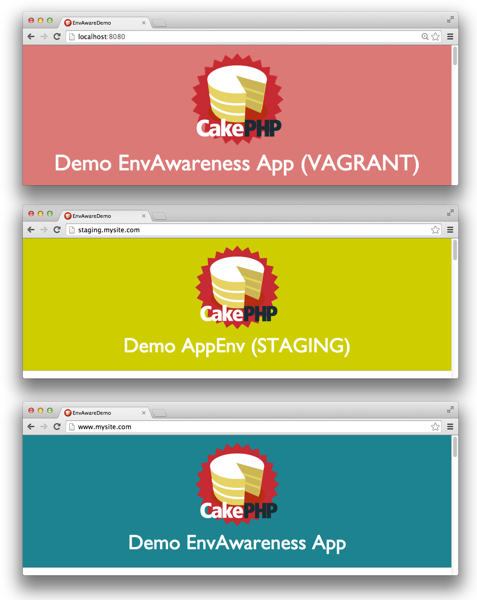

footer: Brian Porter, 2015 [CC BY-SA 4.0](http://creativecommons.org/licenses/by-sa/4.0/)
slidenumbers: true


## Running a CakePHP App in Different Operating Environments


### Brian Porter
### Project Lead & Web Developer at Loadsys

^ This is Running CakePHP Apps in Different Operating Environments. I'm Brian Porter, and I'm a project lead and web developer for Loadsys.


---
## Overview

* What do I mean by "operating environments"?
* How can an app's needs change based on the environment?
* Various methods for configuring Cake per-environment.
* Properties of an ideal env-aware config system.
* Examples.

^ The purpose of this talk is to explore a situation that most modern web apps face: That your app will usually have to run in different environments, and its needs may be different in each one.

^ I'd like to review some approaches for dealing with that.

^ Then outline some properties of "the best system possible" for solving this particular problem and suggest an implementation that works pretty well to meet them.

^ I'll wrap up with some practical examples and tips.

^ All examples will reference Cake 3, but are easily applied to Cake 2.x and even Cake 1.x with small modifications.


---
## What are "operating environments"?

* Developer's workstation or Vagrant virtual machine.
* Continuous integration or testing server. (Travis, Jenkins)
* Quality assurance site.
* Staging site used for stakeholder review.
* Production instances.

^ I'd like to start by explaining what I mean by an "operating environment."

^ An operating environment describes the unique server and resource setup under which your app is expected to run. 

^ The simplest example is your local development machine, versus your production site.

^ Environments have different needs and serve different purposes.

^ Your app may have to behave differently depending on where it is running.


---
## How are your app's needs different in each environment?

* Database connections.
* SSL availability or enforcement.
* Email delivery configuration.
* External API integration (Paypal, Stripe, Mailchimp, Google Analytics).

^ How do your app's needs change in each environment?

^ The most common example of an environment-specific configuration is your database connection. Typically the DB settings do not overlap between the developer's local working copy and the production server.

^ There are many more examples of this and they almost always fall along the outer "edge" of your application where your app interfaces with external services, such as the database, email, or API services.

^ For example, when running your app in a quality assurance environment, you may want to override how email is delivered from your application-- redirecting all of it to QA staff so they can verify it. Or to avoid HTTP connections to API services when running your unit test suite.


---
## The most basic example

Who hasn't needed to set different database connection values in development and production?


[^xkcd]: Exploits of a Mom xkcd.com/327

^ To demonstrate what I'm talking about, let's briefly look at database connections.

^ Almost every web application needs to use a different database connection when the developer is working on a local copy versus when it is running in production.

^ [^xkcd] I'll pause for a second to give you time to read my favorite database joke.


---
## `config/app.php` in development

```php
return [
    'Datasources' => [
        'default' => [
            // *snip*
            'host' => 'localhost',
            'database' => 'my_app',
            'username' => 'my_app',
            'password' => 'secret',
        ],
    ],
];
```

^ An example of database connection settings in Cake 3, for a local dev environment.

^ No problem so far...


---
## `config/app.php` in production

```php
return [
    'Datasources' => [
        'default' => [
            // *snip*
            'host' => 'mine.us-east-1.rds.amazonaws.com',
            'database' => 'production_app',
            'username' => 'production_app',
            'password' => 'rw8d&FI.?:@2',
        ],
    ],
];
```

^ But when we go to launch our app to the public, these settings need to change.

^ The conflict is that we need the same config keys to exist in the same file, but with different values depending on the environment. 


---
## How can we handle this difference?

* There are many approaches.
* They all have different complexity and tradeoffs.
* Let's start with some common ones...

^ What can we do? Well, there are many ways to approach this problem.

^ Let's take a look at some of the common ones.


---
## :x: Switching on environment inline :x:

```php
// src/Template/Layout/default.ctp
<?php
if ($_SERVER['SERVER_NAME'] === 'www.site.com') {
	echo 'This is production';
} elseif ($_SERVER['SERVER_NAME'] === 'stage.site.com') {
	echo 'This is staging';
} else {
	echo 'This is development';
}
?>
```

^ We can try checking the domain name and doing something different for each match we recognize.

^ Now this isn't too bad when it's a "simple" display string in one of your templates or views...


---
## :x: Switching on environment inline :x:

```php
if ($_SERVER['SERVER_NAME'] === 'www.site.com') {
	Configure::write('Datasources.default', [
		'className' => 'Cake\Database\Connection',
		'driver' => 'Cake\Database\Driver\Mysql',
		'persistent' => false,
		'host' => 'prod-db-server.amazonaws.com',
        //'port' => '3306',
		'username' => 'rdsuser',
		'password' => 'O*&0tIT4bVfr7^%CU12',
		'database' => 'productionsite',
		'encoding' => 'utf8',
		'timezone' => 'UTC',
		'cacheMetadata' => true,
        'quoteIdentifiers' => false,
	];
} //...
```

^ But if we go back to our all too common database setup,

^ It's another thing when you're having to repeat big, ...


---
## :x: Switching on environment inline :x:

```php
elseif ($_SERVER['SERVER_NAME'] === 'stage.site.com') {
	Configure::write('Datasources.default', [
		'className' => 'Cake\Database\Connection',
		'driver' => 'Cake\Database\Driver\Mysql',
		'persistent' => false,
		'host' => 'staging-db-server',
        'port' => '3307',
		'username' => 'common',
		'password' => 'password',
		'database' => 'staging',
		'encoding' => 'utf8',
		'timezone' => 'UTC',
		'cacheMetadata' => true,
        'quoteIdentifiers' => false,
	];
} //...
```

^ ...only-slightly-different chunks of code, all over your app to control behavior.


---
## :x: Switching on environment inline :x:

```php
else {
	Configure::write('Datasources.default', [
		'className' => 'Cake\Database\Connection',
		'driver' => 'Cake\Database\Driver\Mysql',
		'persistent' => false,
		'host' => 'localhost',
		'username' => 'root',
		'password' => 'root',
		'database' => 'default',
		'encoding' => 'utf8',
		'timezone' => 'UTC',
		'cacheMetadata' => true,
        'quoteIdentifiers' => false,
	];
}
```

^ Yes, that's one big huge if/elseif/else.


---
## What's wrong with that?

:heavy_minus_sign: Very verbose.
:heavy_minus_sign: Hardcoded to 3 specific environments.
:heavy_minus_sign: Code must change if domain names change.
:heavy_minus_sign: The env flag being checked is duplicated in the code.

^ This approach has a bunch of problems.

^ It can get pretty verbose and repetitive if you have to define many big chunks of similar-but-different code.

^ It's limited to only the specific domain names you code in,

^ And every place you use this has to change if those domains ever change.


---
## :x: Not storing configs in the repo at all :x:

```bash
$ cat .gitignore
tmp/
vendor/
config/app.php
#...
```

^ Okay, so... maybe we can avoid some of those problems if we just don't store any of those differing configs in the project repository at all.

^ Let's ignore our `config/app.php` file completely and maintain a copy directly in each environment.

^ This means that when a developer clones the project, they'll have to build an entire `app.php` from scratch with all of the settings the app requires. (Which you should probably document somewhere.)

^ And when you launch your app, you'll have to write out another entire `app.php` file directly on your production server (or servers) with appropriate values.


---
## What's wrong with excluding configs from the repo?

:heavy_plus_sign: No sensitive info in the repo.

:heavy_minus_sign: No definitive list of Configure keys the app requires.
:heavy_minus_sign: No backups or history, not self-documenting.
:heavy_minus_sign: Troubleshooting is harder.
:heavy_minus_sign: Still not DRY.
:heavy_minus_sign: Still fragile.

^ On the up side, we've managed to remove some passwords from the repository.

^ But we can't track changes to the set of configs the app depends on in source control.

^ We also can't double-check the value of a particular setting in a given env without logging into the appropriate server.

^ Worse, the config definitions don't live with the code where they are used. (Definitions live on running servers, usage lives in the codebase.)

^ Someone with access to each env must manually update configs when they change. If a dev adds a new key in the code, each server needs to be updated to define it and an appropriate value.

^ So there are some issues there.


---
## :x: Store individual config files in the repo :x:

```bash
# Access the server
$ ssh deploy@production-server.com
$ ls config/app*
app.prod.php
app.staging.php
app.qa.php
app.dev.php

# "Deploy" new code
$ git pull origin master

# Copy updated config into place.
$ cp config/app.staging.php config/app.php
```

^ What if we take the opposite approach and store **all** of the configs in the repo for every environment.

^ This will probably require getting creative with file names so we can keep track of which configs belong to which environment.

^ This eases the deployment process a ton-- now we can just copy the correct config into place for the server we're on.

^ _(This was **much** worse with Cake 2.x, where you might have a copy of `core.php`, `email.php` and `database.php` for every environment.)_


---
## Oops!

```bash
$ ssh deploy@production-server.com
#                ^
#                production server

$ cp config/app.staging.php config/app.php
#                ^
#                copied the wrong config!
```

^ Oh, but we made a mistake.

^ We were logged into the production server, but we copied the staging config file into place. That's going to cause issues.


---
## What's wrong with copying files?

:heavy_plus_sign: Easy to understand.
:heavy_plus_sign: Configs stored in repo.

:heavy_minus_sign: Not DRY.
:heavy_minus_sign: Fragile for devs _and_ sysadmins.
:heavy_minus_sign: Potential security risk. 

^ It's good that you can read the `config/` directory and have a reasonable idea of what's happening.

^ Also good that changes to configs are tracked in the repo.

^ Bad because you have to maintain the FULL set of keys and values in EVERY file.

^ Developers may forget to update an "identical" setting in all copies of the file.

^ As we saw, without automatic tooling in place for deploys, a developer or sysadmin may forget to copy an updated config file into the correct place, or copy the wrong config. We've left the door open for human error.

^ We also again the issue that storing API keys and passwords in the repo might be bad.


---
## Concepts

What are the properties of the _ideal_ system for handling custom configurations per environment?

^ Let's switch gears and talk about what an ideal system would need to look like in order to solve as many of these complications as possible.


---
## A single "switch" **from** the environment defines it

Example using Apache's `SetEnv`:

```apache
# my_apache_vhost.conf
<VirtualHost *:80>
    ServerName stagingsite.com
    SetEnv APP_ENV staging
</VirtualHost>
```

and a command line env var:

```bash
# ~/.profile or ~/.bash_profile
# Make sure env is set for Cake Shells.
export APP_ENV=staging
```

^ First, we want to isolate detection of the environment to a single "switch".

^ This can really be anything that can be defined per-environment, but I prefer an environment variable.

^ In this case it's an environment variable named `APP_ENV` set to an arbitrary string that describes the environment.


---
## The environment switch should be "artificial"


The environment flag used must be maleable to adapt to changing circumstances.

_Define your own "independently controllable" environment switch to maintain control of your own destiny._

[^choices]: John Holm (CC BY 2.0)<br>flickr.com/photos/29385617@N00/2366471410

^ It might be tempting to use an "organic" value for the environment switch, such as a server hostname, or IP address.

^ But this binds your config naming to something outside of your control, and that can severely restrict your choices in the future.

^ Better to use something you can define and change independently of everything else.

^ In this sense, we want to "define" an environment, not "inherit" one.

^ [^choices]


---
## All non-sensitive config values are tracked

All environment configs (except those deemed "sensitive") must be tracked in the repo with the code that utilizes them.

Developers must have access to add or change config both where they are defined _and_ where they are used.

_Config changes must not require more than one role (dev + sysadmin) or be done in more than one place (repo + servers)._

^ Next, we want to leverage source control to the full extent that it's possible.

^ That is, without compromising security.

^ So all (non-sensitive) configs for every known environment must be tracked in source control.

^ This helps guarantee that a developer can add or change a config key both where it's declared and where it's used.


---
## Convention is favored over configuration

The app must first be designed to function regardless of the environment.

In other words: Whenever possible, build so that it doesn't matter what environment you are running in.

_Adding environment-specific settings must be done only when there is no other choice._

^ The next step is to realize that the easiest environment-specific configuration to manage is the one that doesn't need to change.

^ That means that whenever possible, we should try to engineer our code so that it does the same thing regardless of the environment.

^ We will only fall back to differing config values when we have no other choice.


---
## Env-specific settings are checked and loaded **once**

The app must check _"the thing that defines the environment"_ (environment var, Apache SetEnv, hostname, etc.)  **exactly once**.

The app must perform logic for loading configs for that environment **at that point**.

_If the environment detection needs to change in the future, there is only one place in the code to change._

^ We want to keep the code that changes our app's behavior DRY, so if we need to update **how** we change that behavior for each environment, it doesn't have to be done in many places all over the app.

^ So we want the app to check for the environment at one point only, and fully set up the configs for that environment at the same time.

^ From then on, the app will run with that single collection of configs (just with different values).


---
## All environments read the same set of keys

The app must not use retrieved config values in conditional clauses. (`if/else`)

Do **not** do different things depending on a config value: Do the same thing using the different values.

_Let the config bootstrapping process **be** the conditional statement by relocating values from the app into the configs._

^ Which suggests the next characteristic: The set of config keys should be the same in every environment, only differing in value.

^ There's a corollary this: It means your app should never have to use a retrieved config value as an `if` conditional clause. Instead, perform the same action all the time, but using the config value as the argument.


---
## Production is the default case

The _most important environment_ your app runs in must be the master of all things.

The app must function correctly in that environment even without an explicit environment set.

_Protect the mission-critical environment from being effected by a missing or invalid environment setup._

^ Next, and as always, we want to reduce the possibility of human error, so we're going to make our most important environment the "default" configuration set.

^ What this means is that the app must run with production settings even if we fail to detect our environment or if it's misconfigured beyond recovery.

^ That way if any environment is going to be misconfigured and cause the app to fail, let it be staging, qa or development.


---
## Only necessary keys are overridden (and minimally so)

Leverage the production valus as "defaults" as much as possible.

Keep the other configs DRY by overriding **only** what is different in each environment.

_Reduce the risk of "missing" a config that is defined in multiple places to the minimum possible._

^ We also want to avoid duplication in the config declarations themselves, again to reduce the chance that a developer misses updating multiple "versions" of the same config key or value.

^ A good example of this is `debug`. We want it to default to `false` for production, and only selectively turn on in development, testing and review environments.

^ We won't even define a `debug` key in any environment where the value mirrors production.


---
## Support untracked overrides for testing and security

The app must allow for a developer to change a config while testing a feature locally without committing the "test" settings.

The app must support situations where sensitive configs must not be stored in the repo.

_Provide a fallback for situations where tracking **all** config files is a hinderance to get the best of both worlds._

^ There's still the case of highly sensitive configs that we shouldn't or can't commit to the repo.

^ To address this, our system need to be able to recognize and selectively load an additional set of untracked config values.

^ This will let devs change settings in that untracked file in development for testing without accidentally COMMITTING those "test" settings in a "real" config.

^ It also allows a client to maintain privacy/secrecy of passwords/keys used by the app by letting them fill in a templated set of configuration keys for production use.


---
## App is ignorant of its environment(s)

The app itself must never be "aware" of the different environments.

It should always be presented with a **single** set of configs to use.

_Provide the same collection of config keys to all environments. Change only their values per-environment._

^ This one can get a little heady. We want to mentally separate the Cake app from the config set it consumes.

^ The Cake app should only know about a single config set, and be ignorant of how that config set was compiled for its use.

^ In other words: The Cake app doesn't care how the config set came to be-- it's just going to run with the values provided to it.

^ You'll know you've broken this rule if you find yourself referring to the value of the environment switch directly in your code. If I'm using the static string `'staging'` anywhere in my code, that should be a warning bell.


---
## Remember this example?

```php
// src/Template/Layout/default.ctp
<?php
if ($_SERVER['SERVER_NAME'] === 'www.site.com') {
	echo 'This is production';
} elseif ($_SERVER['SERVER_NAME'] === 'stage.site.com') {
	echo 'This is staging';
} else {
	echo 'This is development';
}
?>
```

^ Let me give you a practical example by returning to this snippet from earlier.


---
## How about this instead?



```php
// src/Template/Layout/default.ctp
<?php
	echo Configure::read('Env.Message');
?>
```

How do we make that happen?

^ By applying the rules above, we can convert it into this much simpler version.

^ But obviously there more to it behind the scenes.


---
## Cake's `Configure` class

Cake stores runtime configuration using the `Configure` class.

```php
// Define a key in config/app.php:
Configure::write('MySection.MyKey', 'Cake is awesome');


// Recall the value anywhere else:
echo Configure::read('MySection.MyKey');
```

^ The first step is to take advantage of a really well built system that's already available to us. Cake's `Configure` class.


---
## Cake's `Configure` class

* Has an excellent API for setting, overriding and accessing values.
* Is accessible nearly everywhere in a Cake app.
* With Cake 3, it is also better unified.
	(DB, Email, Cache and App settings all in one place.)

This makes it an ideal mechanism for storing environment-specific settings.

^ It let's us define a config key (normally during the app bootstrapping process) and recall it practically anywhere else in the code.

^ It also already provides us with tools to load additional sub- or super-sets of keys and merge them into the existing set.

^ And to top it off: as of Cake 3, all of the previously separate configurations have been unified into Configure and the core app skeleton already does almost all of the work for us.


---
## Leveraging the Configure class

* By default, Cake already loads all settings defined in `config/app.php`.

* This is now your "mission-critical" (default) config, typically production.

* We will define per-key override values in additional environment-specific config files.

* Which additional file is loaded will depend on the value of your environment flag.

^ On top of normal Cake conventions, we're going to add a few of our own to keep things sane.

^ First, the stock `config/app.php` becomes our production-slash-default config.

^ We'll create a new file for each additional environment, and define **only** the values that need to be different from production in each.

^ Then to extend `Configure`s capabilities to include environment awareness, we'll add some code to the bootstrapping process to load those files.


---
## Environment reminder

Apache `SetEnv`:

```apache
# my_apache_vhost.conf
<VirtualHost *:80>
    ServerName stagingsite.com
    SetEnv APP_ENV staging
</VirtualHost>
```

and a command line environment variable:

```bash
# ~/.profile or ~/.bash_profile
export APP_ENV=staging
```

^ Just to orient you, we're going to set up our server with the following artificial environment flag.

^ We'll be using this to determine which additional config file to load.


---
## Stock `config/bootstrap.php`

Cake 3 ships with the following code:

```php
// config/bootstrap.php
try {
    Configure::config('default', new PhpConfig());
    Configure::load('app', 'default', false);
} catch (\Exception $e) {
    // Failure to load the mission-critical
    // config is a fatal error.
    die($e->getMessage() . "\n");
}
```

^ Here's what Cake 3's normal config loading mechanism looks like.

^ In this case, it's important to note that if we fail to load the default config file, everything aborts. This is a fatal error and we want to keep it that way since this is our production config. If this file is missing, we're in serious trouble.


---
## Loading additional env-specific configs

```php
// config/bootstrap.php

// After loading the stock config file,
// load the environment config file
// and the local config file (when present.)
try {
	$env = getenv('APP_ENV');
	Configure::load("app-{$env}", 'default');
	Configure::load('app-local', 'default');
} catch (\Exception $e) {
	// It is not an error if these files are missing.
}
```

^ After loading the default config file, we're going to add this snippet to our bootstrap.php file.

^ This will attempt to load two additional configs. The first from a file named after our artificial environment switch value, and the second a file ignored by source-control that we can use for local overrides.

^ It's important to note that if either of these files are missing, we just stick to our production configs and move right along.

^ The impact is that any misconfigured environment will simply behave like it was production until you fix it.

^ The good news is that even production will behave like production in the absence of the environment switch value.


---
## `config/app.php`

```php
return [
	'debug' => false,
    'Env' => [
    	'FancyName' => 'Wonderful Application',
    	'Message' => 'This is production',
    	'HintColor' => '#ffffff',
    ],
];
```

^ With that additional file loading in place, let's take a look at a small sample production config file.

^ In this simplified case, all we're doing is ensuring `debug` is off, and defining a message unique to this environment.


---
### `config/app-staging.php`

Development, overrides only:
 
```php
return [
	'debug' => true, // Turn debug on in development environments.
    'Env' => [
    	// (Note that we don't change the [FancyName] key.)
    	'Message' => 'This is staging',
    	'HintColor' => '#ffffcc', // yellow in staging
    ],
];
```

^ Next, in our "staging" override file, we're going to override the production value for `debug` to turn it on, and we're also going to override our unique message and color so we can provide a hint to users or admins about the current environment.

^ Note that we have **not** overridden the `FancyName` of the app-- it will continue to use the value defined previously in the production config.


---
## What gets committed?

* `config/app.php`
* `config/app-*.php`
	* _except `config/app-local.php`_
* Add `/config/app-local.php` to `.gitignore`.

^ Now it's time to get everything committed to source control.

^ We include both variants of our `app.php` config file, and we add `config/app-local.php` to our .gitignore file.

^ (Each checked out copy of the repo can define its own overrides there.)


---
## And we're done changing the code.

Now this example works, and prints a different message depending on the value of the `APP_ENV` environment variable.

```php
// src/Template/Layout/default.ctp
<?php
	echo Configure::read('Env.Message');
?>
```

^ And we're done making changes already.

^ The example here now works as advertised, using an `APP_ENV` environment variable with a recognized value as defined by your server.

^ We've provided a way to hint at our environment in the browser in all non-production instances.

^ We can also temporarily set our own `Env.Message` value in `app-local.php` if we want to test it with a difference character set or emoji or something else locally.


---
## How well does this meet the ideal requirements?

:white_check_mark: Uses a single switch from the environment.
:white_check_mark: The environment switch is artificial.

```apache
<VirtualHost *:80>
	SetEnv APP_ENV staging
</VirtualHost>
```

^ How does this approach stack up to our ideal requirements?

^ We use a single switch to control the environment, and its defined artificially so it's under out control.


---
## How well does this meet the ideal requirements?

:white_check_mark: All non-sensitive configs are tracked.
:white_check_mark: Untracked overrides supported for testing/security.

```bash
$ ls config/app*
app.php
app-staging.php
app-quality.php
app-vagrant.php
app-local.php
```

^ We're tracking all non-sensitive configs in source control for every environment.

^ We can still scan the `config/` directory and have a pretty good idea of the different places the app needs to run.

^ And anything that **is** sensitive can be defined in `app-local.php` on each server.


---
## How well does this meet the ideal requirements?

:white_check_mark: Env-specific settings are checked and loaded once.
:white_check_mark: Production is the default case.

```php
try {
	$env = getenv('APP_ENV');
	Configure::load("app-{$env}", 'default');
	Configure::load('app-local', 'default');
} catch (\Exception $e) {}
```

^ We only need to check and load our environment once.

^ If that check and load process fails, we default to production.


---
## How well does this meet the ideal requirements?

:white_check_mark: App is ignorant of its environment(s).
:white_check_mark: All environments read the same keys.

```php
<?php
	// We don't need to use `getenv()`
	// anywhere in our code.
	echo Configure::read('Env.Message');
?>
```

^ Because we've been careful with how we store environment-specific values, our app doesn't need to be aware of what actual environment it's in. It can trust that Configure has been loaded properly and just print the value.

^ It's a little harder to demonstrate in an example this basic, but this also means we don't have to resort to reading different keys in different situations.


---
## How well does this meet the ideal requirements?

:white_check_mark: Convention is favored over configuration.
:white_check_mark: Only necessary keys are overridden.

```php
// config/app-staging.php
return [
	'debug' => true,
    'Env' => [
    	'SignalColor' => '#77cccc',
    ],
];
```

^ Because our secondary environment config files only define necessary overrides, we've kept maintenance work to a minimum.

^ We've also favored convention over configuration by quietly defaulting to production values.

^ All in all, this approach ticks a lot of the boxes pretty well.


---
## Another Example

```php
// View/Helper/UtilityHelper.php

public function envHint($env = null) {
	$env = (isset($_SERVER['APP_ENV']) : $_SERVER['APP_ENV'] : null);
	switch ($env) {
		case 'vagrant': $css = 'background: #ff9999;'; break;
		case 'staging': $css = 'background: #e5c627;'; break;
		       default: $css = '';                     break;
	}
	if (!empty($css) && Configure::read('debug') > 0) {
		return sprintf('<style>.navbar-fixed-top{%s}</style>', $css);
	} else {
		return '';
	}
}
```

^ First, I had to get a little "creative" to get this example to fit on the slide and be readable. Don't go all "PSR" on me.

^ Even after switching to the config loading process I just outlined, I wrote this (bad) helper method to assist in signaling the environment to the user sitting in front of the browser.

^ What's bad about this? Lots!

^ I'm using `$_SERVER['APP_ENV']` directly! I'm doing things with static values! I've bound my code to the **values** of the environments! I've hard-coded CSS into the helper function!

^ What does the refactor look like?


---
## Another Example

```php
// View/Helper/UtilityHelper.php

public function envHint() {
	$format = (string)Configure::read('Env.Hint.Format');
	$snippet = (string)Configure::read('Env.Hint.Snippet');

	if (!empty($snippet) && Configure::read('debug') > 0) {
		return sprintf($format, $snippet);
	} else {
		return '';
	}
}
```

^ Move things into Configure! Let **it** worry about the correct values for each environment. We don't have to care about the environments-- we get to just use the Configure values we expect in all of them.

^ One of the design goals was to ensure this never engaged in production, so we keep the `debug` check.

^ But! No more hard-coded `$_SERVER['APP_ENV']` or `prod`, `staging`, `vagrant` etc.

^ We can define a single `format` in the core.php config now, and we only have to specify the correct `snippet`s in `core-staging`, `core-vagrant` etc. So no unnecessary code duplication.

^ Gives us _even better_ flexibility since we can now control the CSS being used completely.

^ The code is cleaner and more readable.


---
## Demo Project

[github.com/beporter/CakePHP-EnvAwareness](https://github.com/beporter/CakePHP-EnvAwareness)

* A demo Cake 3 app with vagrant.
* Includes [loadsys/cakephp-config-read](https://github.com/loadsys/CakePHP-ConfigReadShell), a Shell for command line access to (environment-specific) Configure vars.
* Switches app background color based on env.

^ Since I'm pressed for time here, I have an example project up on GitHub that is set up as this talk describes.

^ It provides some walkthroughs for thinking about and working with environment-specific values.


---
## Cake 2.x

* Works in 2.x via `Config/core.php`.
	* Requires a boilerplate `database.php` and `email.php` that load their configs from `Configure` instead of defining static class properties.
	* @TODO: Full examples in the demo repo on the `cake-2x` branch.

^ The sample project also has a `cake-2x` branch that demonstrates the same concepts.

^ It's slightly more setup since we need to deal with the separate `database.php`, `email.php` and `core.php` files, but the example project includes boilerplate versions of these files that load their configurations using `Configure` instead of the normal process of defining class properties.
 
 
---
## Cake 2.x: Config

```php
// Config/core.php

Configure::write('Datasources', array(
	'default' => array(
		'datasource' => 'Database/Mysql',
		'host' => 'localhost',
		'login' => 'dbuser',
		'password' => 'password',
		'database' => 'my_db',
	),
));

Configure::write('EmailTransport', array(
	'default' => array(
		'transport' => 'Mail',
		'from' => 'real-person@site.com',
		'charset' => 'utf-8',
		'headerCharset' => 'utf-8',
		'emailFormat' => 'html',
	),
));
```

^ As a quick preview at how this works in Cake 2, here's a snippet from the `core.php` file.

^ To start, we're defining our database and email configs here. You can use all of the same properties as you would normally, and even define multiple connections beyond the `default` key.


---
## Cake 2.x: Env Loading

```php
// Config/core.php

// At the end of the file
$env = getenv('APP_ENV');
if (is_readable(dirname(__FILE__) . DS . "core-{$env}.php")) {
	Configure::load("core-{$env}");
}
if (is_readable(dirname(__FILE__) . DS . 'core-local.php')) {
	Configure::load('core-local');
}
```

^ Then at the bottom of the file we add the same kind of supplemental loading, again only if the files are found to exist to keep `Configure::load()` from complaining.


---
## Cake 2.x: Boilerplate Database

```php
// Config/database.php

class DATABASE_CONFIG {
	public $default = null;
	public function __construct() {
		$dbConfigs = Configure::read('Datasources');
		if (!is_array($dbConfigs)) {
			throw new Exception('No `Datasources` connections defined in core.php.');
		}

		foreach ($dbConfigs as $key => $config) {
			$this->{$key} = $config;
		}

		if (!property_exists($this, 'default') || !is_array($this->default)) {
			throw new Exception('No `Datasources.default` connection defined in core.php.');
		}
	}
}
```

^ Then to adapt our database.php file, we rewrite it to populate all of its keys from Configure.

^ We'll throw exceptions if the minimum necessary `$default` config is missing as a warning to devs.

^ This file can then just get committed to source control as-is. It will never have to change again for the life of the app, since all of the actual connection strings are defined in core.php now.


---
## Cake 2.x: Boilerplate Email

```php
// Config/email.php

class EmailConfig {
	public $default = array();
	public function __construct() {
		$emailConfigs = Configure::read('EmailTransport');
		if (!is_array($emailConfigs)) {
			throw new Exception('No `EmailTransport` key defined in core.php.');
		}

		foreach ($emailConfigs as $key => $config) {
			$this->{$key} = $config;
		}

		if (!property_exists($this, 'default') || !is_array($this->default)) {
			throw new Exception('No `EmailTransport.default` array defined in core.php.');  
		}
	}
}
```

^ Same kind of thing with `email.php`. If your app doesn't require at least one valid email config, you can remove the clause that throws the Exception.

^ Again this file is now "static" for all intents and purposes, since the values are in core.php.

^ This is actually another great example of how to move "environment-awareness" out of your app's codebase and into Configure.


---
## Other random points

* This process even works all the way back in 1.2/1.3.
	* **Mind `Configure::load()` in 1.x**: It overwrites entire keys instead of merging.
	* No examples _(get away from 1.x please)_, but you can ask me about it.

^ This approach does work in Cake 1.2 and 1.3 apps as well, but with a very important caveat about how Configure loads additional configs that you need to keep in mind.

^ Basically, Configure::load() replaces keys instead of merging them, so we lose the ability to depend on the Production configs as much as we can in Cake 2 and 3.

^ I'm not providing examples because seriously, you should be doing your best to get away from Cake 1.x at this point.

^ That said, come talk to me about it if you're curious about the differences.


---
## Parting Tips

* Visibly mark your non-production environments.
* Try to standardize on a single environment switch.
* Requiring an env switch can be a gotcha for "in between" environments.
* Make sure your cron jobs execute with the correct environment set.
* Translations and environments get complicated. (Aka, the `__()` function.)


^ I recommend exposing your environment in the browser, _somehow_. Change the background color of your admin portal for every environment except for production, so you can tell at a glance if your env-switching is working.

^ Try to use a consistent switch method and key name. This is a convention over configuration thing. When you're trying to figure out why env switching isn't working, you should have to check as few places as possible.

^ The fact that other environments require an artificial env switch to be configured can be a gotcha, especially for "in between" spots like staging. In practice, production doesn't require anything special, and if you use vagrant, you can configure your VM to ship with the necessary settings by default, but your project readme or documentation should still explain what the switch is and how to set it so it doesn't catch anyone off guard.

^ Along the same lines, if you're running Cake shells as cron jobs, make sure you're setting the environment flag in a way that will be present in cron. Again, this isn't a problem in production where it matters most, but you'll specifically forget to think about this in other environments for that exact reason.

^ And finally, in Cake 2, it's possible to pre-translate any end-user-visible string values you want to store in Configure and have them be env-aware by wrapping your value in the double-underscore method right where they are declared in `core.php`. This doesn't work quite as seamlessly in Cake 3 any more because the Cache will not yet be configured if you try to use `__()` in your `app.php` file. This requires getting a bit more inventive and I haven't worked out a solid pattern I can recommend for addressing that yet. Let me know if you do!


---
## `exit(0);`

Brian Porter
[@beporter](https://twitter.com/beporter)
<sub>_(you probably shouldn't follow me- you'll be disappointed.)_</sub>

Project Lead & Web Developer at Loadsys
[loadsys.com](http://loadsys.com)

Slides (with speaker notes) & Demo Project
[github.com/beporter/CakePHP-EnvAwareness](https://github.com/beporter/CakePHP-EnvAwareness)

^ That's it. I hope this talk has given you some things to think about.

^ I love talking about this topic, so please, feel free to come find me and ask questions.

^ Time for questions?

^ Thanks.
